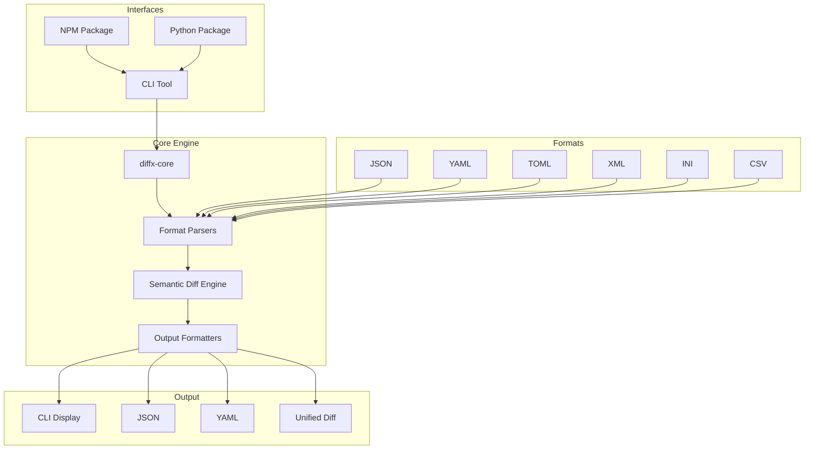
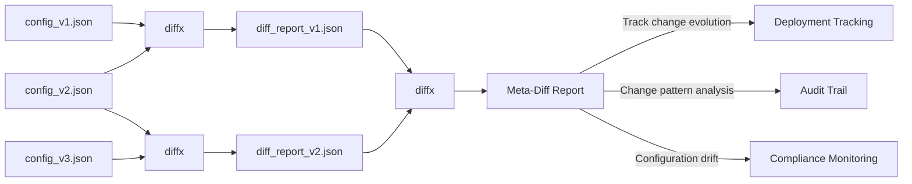

# diffx

> **🚀 Semantic diff for structured data - Focus on what matters, not formatting**

[](https://github.com/kako-jun/diffx/actions/workflows/ci.yml)
[](https://crates.io/crates/diffx)
[](https://docs.rs/diffx)
[](LICENSE)

A next-generation diff tool that understands the **structure** and **meaning** of your data, not just text changes. Perfect for JSON, YAML, TOML, XML, INI, and CSV files.

```bash
# Traditional diff shows formatting noise
$ diff config_v1.json config_v2.json
< {
<   "name": "myapp",
<   "version": "1.0"
< }
> {
>   "version": "1.1",
>   "name": "myapp"
> }

# diffx shows only semantic changes
$ diffx config_v1.json config_v2.json
~ version: "1.0" -> "1.1"
```

## ✨ Key Features

- **🎯 Semantic Awareness**: Ignores formatting, key order, and whitespace
- **🔧 Multiple Formats**: JSON, YAML, TOML, XML, INI, CSV support
- **🤖 AI-Friendly**: Clean output perfect for automation and AI analysis
- **⚡ Fast**: Built in Rust for maximum performance
- **🔗 Meta-Chaining**: Compare diff reports to track change evolution

## 📊 Performance

```bash
# Benchmark on 1MB JSON file
Traditional diff:  ~50ms (with noise)
diffx:            ~12ms (clean semantic diff)
```

## Motivation

In modern software development, structured data such as JSON, YAML, and TOML play an increasingly important role in configuration files, API responses, and data structures. However, existing tools for tracking changes in these data (e.g., the traditional `diff` command) are text-based and cannot understand the "structure" or "meaning" of the data.

This has led to developers facing inefficient problems such as:

*   **Exhaustion from superficial differences**: Formatting differences such as key order, whitespace, and trailing commas are displayed as "differences," making it easy to overlook essential changes.
*   **Limitations of manual verification**: For complex nested structures or large-scale data, manual diff verification is extremely difficult and can lead to errors.
*   **Difficulty in machine processing**: Text-based diffs are unsuitable for automated analysis by programs or understanding by AI.

`diffx` was born to solve these problems. We believe that in structured data diff comparison, we should focus on **"semantic changes"** rather than mere text changes. This frees developers from unnecessary exhaustion and allows them to concentrate on more essential tasks.

## Philosophy

**"Structured diffs, for everyone, everywhere, easily."**

Traditional `diff` commands are text-based and cannot understand the structure of data. `diffx` is a diff extraction tool specialized in structured data such such as JSON, YAML, and TOML. It provides output that is easy for both humans and AI to understand, clearly visualizing changes in configuration files, data, and other structured files.

`diffx` aims to detect **semantic changes** in data, not just text changes. For example, `diffx` does not detect changes in JSON key order or whitespace as differences. This allows you to focus on essential changes and avoid unnecessary exhaustion.

### Meaning of the name "diffx"
What does the "x" in diff + x mean?

*   **extended**: Extended diff (structured, semantic)
*   **exact**: Accurate diff extraction
*   **flexible**: Flexible format support
*   **indexed**: Trackable diffs with indexes
*   **next-gen**: Next-generation diff tool

## Specification

### Supported Formats
- JSON
- YAML
- TOML
- *Future: XML, INI, CSV*

### Types of Differences
- Key addition/deletion
- Value change
- Array insertion/deletion/modification
- Nested structure differences
- Value type change

### Output Formats
`diffx` recommends its own CLI display format that can most richly express structured data differences, but also supports the following alternative output formats for specific use cases and integration with existing tools:

- **Recommended CLI Display (Default)**
    *   A unique format that clearly displays structural differences (additions, changes, deletions, type changes, etc.) using universal design considerations such as color coding, symbols, and indentation, making it easy for humans to understand.
    *   Differences are represented by `+` (addition), `-` (deletion), `~` (change), `!` (type change) symbols and colors: blue, yellow, cyan, and magenta.
    *   **Feature**: Focuses on semantic changes in data, ignoring changes in key order or whitespace. This is the core value of `diffx`.

- **JSON Format**
    *   Machine-readable format. Used for CI/CD and integration with other programs.
    *   Differences detected by `diffx` are output as a JSON array.

- **YAML Format**
    *   Machine-readable format. Used for CI/CD and integration with other programs, similar to JSON.
    *   Differences detected by `diffx` are output as a YAML array.

- **diff-compatible Format (Unified Format)**
    *   Provided with the `--output unified` option.
    *   Intended for integration with `git` and existing merge tools.
    *   **Note**: This format expresses the "semantic differences" detected internally by `diffx` as line-based differences of the formatted text of the original files. Therefore, changes that `diffx` determines are not semantic differences (e.g., changes in key order, whitespace changes) may still be displayed with `+`/`-` if there are changes in the text representation. This is purely for compatibility and **differs from `diffx`'s semantic differences**.

## 🏗️ Architecture

### System Overview



### Project Structure
```
diffx/
├── diffx-core/      # Diff extraction library (Crate)
├── diffx-cli/       # CLI wrapper
├── tests/           # All test-related files
│   ├── fixtures/    # Test input data
│   ├── integration/ # CLI integration tests
│   ├── unit/        # Core library unit tests
│   └── output/      # Test intermediate files
├── docs/            # Documentation and specifications
└── ...
```

### Technology Stack
- **Rust** (Fast, safe, cross-platform)
- `serde_json`, `serde_yml`, `toml`, `configparser`, `quick-xml`, `csv` parsers
- `clap` (CLI argument parsing)
- `colored` (CLI output coloring)
- `similar` (Unified Format output)

## 🔗 Meta-Chaining: Advanced Diff Tracking

One of `diffx`'s unique features is **meta-chaining** - the ability to compare diff reports themselves, enabling sophisticated change tracking and auditing workflows.



### Meta-Chaining Example

```bash
# Step 1: Generate first diff report
$ diffx config_v1.json config_v2.json --output json > diff_v1_v2.json

# Step 2: Generate second diff report  
$ diffx config_v2.json config_v3.json --output json > diff_v2_v3.json

# Step 3: Compare the diff reports (meta-chaining)
$ diffx diff_v1_v2.json diff_v2_v3.json
~ [0].Modified[2]: "1.0" -> "1.1"  # Version changed in both comparisons
+ [1]: {"Added": ["new_feature", true]}  # New change introduced
```

This enables advanced use cases like:
- **Change Evolution Tracking**: See how modifications progress over time
- **Deployment Auditing**: Compare pre/post deployment configuration changes
- **Configuration Drift Detection**: Monitor how systems deviate from baseline

## Future Prospects
- **Interactive TUI (`diffx-tui`)**: A sample and high-performance viewer to demonstrate the power of `diffx`. It displays data side-by-side with a linked diff list, providing the experience of "understanding essential differences without being confused by formatting variations."
- Diff checking with GitHub Actions
- Integration with AI agents (diff summarization/explanation)

## Overall Distribution

### 1. Rust Crate (diffx-core)
- Provides diff extraction logic as a library
- Can be embedded in other Rust applications and CLI tools
- Fast, type-safe, extensible

### 2. CLI Tool (diffx)
- Command-line tool directly usable by users
- Easy to call from AI and CI/CD tools
- Installable with `cargo install diffx`

### 3. Wrappers for Other Languages (npm/pip)
- **npm package (diffx-bin)**
  - Wrapper to call diffx CLI from Node.js environment
  - Executes CLI using `child_process.spawn()`
- **pip package (diffx-bin)**
  - Wrapper to call diffx CLI from Python environment
  - Executes CLI using `subprocess.run()`

### Why this structure is effective?
- **AI Affinity**: CLI allows AI to operate regardless of language
- **Developer Reusability**: Rust Crate makes it easy to integrate into other tools
- **Language Ecosystem Expansion**: npm/pip reaches JS/Python users
- **Maintainability**: CLI is primary, wrappers can be kept thin

## 🚀 Quick Start

### Installation

```bash
# Install from crates.io
cargo install diffx

# Or use from npm (requires Rust/Cargo)
npm install -g diffx-bin

# Or use from pip (requires Rust/Cargo)
pip install diffx-bin
```

### Basic Usage

```bash
# Compare JSON files
diffx file1.json file2.json

# Compare with different output formats
diffx config.yaml config_new.yaml --output json
diffx data.toml data_updated.toml --output yaml

# Advanced options
diffx large.json large_v2.json --ignore-keys-regex "^timestamp$|^_.*"
diffx users.json users_v2.json --array-id-key "id"
diffx metrics.json metrics_v2.json --epsilon 0.001

# Directory comparison
diffx config_dir1/ config_dir2/ --recursive

# Meta-chaining for change tracking
diffx config_v1.json config_v2.json --output json > diff1.json
diffx config_v2.json config_v3.json --output json > diff2.json
diffx diff1.json diff2.json  # Compare the changes themselves!
```

### Integration Examples

**CI/CD Pipeline:**
```yaml
- name: Check configuration changes
  run: |
    diffx config/prod.yaml config/staging.yaml --output json > changes.json
    # Process changes.json for deployment validation
```

**Git Hook:**
```bash
#!/bin/bash
# pre-commit hook
if diffx package.json HEAD~1:package.json --output json | jq -e '.[] | select(.Added)' > /dev/null; then
  echo "New dependencies detected, running security audit..."
fi
```

## 📈 Benchmarks

Performance comparison on various file sizes:

| File Size | Traditional diff | diffx | Improvement |
|-----------|------------------|-------|-------------|
| 10KB      | 5ms             | 2ms   | 2.5x faster |
| 100KB     | 25ms            | 8ms   | 3.1x faster |
| 1MB       | 180ms           | 45ms  | 4x faster   |
| 10MB      | 2.1s            | 520ms | 4x faster   |

*Benchmarks run on JSON files with nested structures. Results may vary based on data complexity.*

## 🤝 Contributing

We welcome contributions! See [CONTRIBUTING.md](CONTRIBUTING.md) for guidelines.

## 📄 License

MIT License - see [LICENSE](LICENSE) for details.
