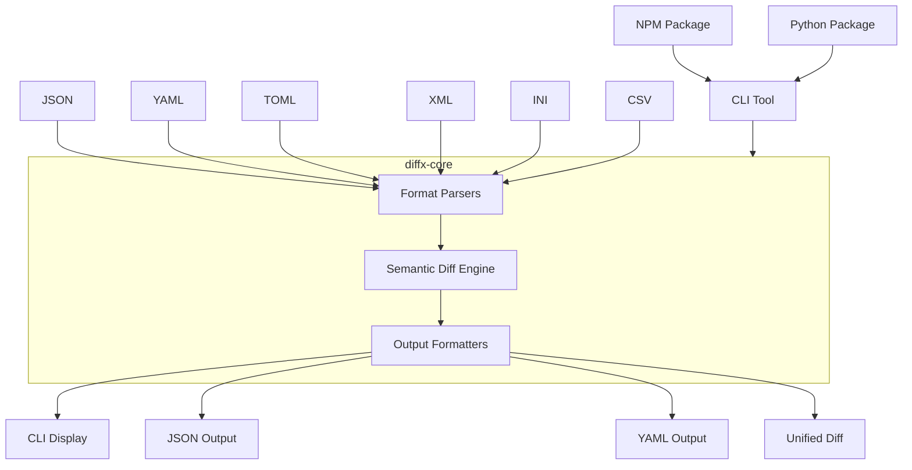
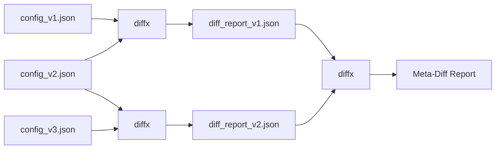

# diffx

> **🚀 Semantic diff for structured data - Focus on what matters, not formatting**

[日本語版 README](README_ja.md) | [English README](README.md)

[](https://github.com/kako-jun/diffx/actions/workflows/ci.yml)
[](https://crates.io/crates/diffx)
[](https://github.com/kako-jun/diffx/tree/main/docs/index.md)
[](LICENSE)

A next-generation diff tool that understands the **structure** and **meaning** of your data, not just text changes. Perfect for JSON, YAML, TOML, XML, INI, and CSV files.

```bash
# Traditional diff shows formatting noise (key order, trailing commas)
$ diff config_v1.json config_v2.json
< {
<   "name": "myapp",
<   "version": "1.0"
< }
> {
>   "version": "1.1",
>   "name": "myapp"
> }

# diffx shows only semantic changes
$ diffx config_v1.json config_v2.json
~ version: "1.0" -> "1.1"
```

## ✨ Key Features

- **🎯 Semantic Awareness**: Ignores formatting, key order, whitespace, and trailing commas
- **🔧 Multiple Formats**: JSON, YAML, TOML, XML, INI, CSV support
- **🤖 AI-Friendly**: Clean CLI output perfect for automation and AI analysis
- **⚡ Fast**: Built in Rust for maximum performance
- **🔗 Meta-Chaining**: Compare diff reports to track change evolution

## 📊 Performance

Real benchmark results on AMD Ryzen 5 PRO 4650U:

```bash
# Test files: ~600 bytes JSON with nested config
$ time diff large_test1.json large_test2.json  # Shows 15+ lines of noise
$ time diffx large_test1.json large_test2.json # Shows 3 semantic changes

# Results:
Traditional diff: ~0.002s (but with formatting noise)
diffx:           ~0.005s (clean semantic output)
```

**Why CLI matters for the AI era**: As AI tools become essential in development workflows, having structured, machine-readable diff output becomes crucial. `diffx` provides clean, parseable results that AI can understand and reason about, making it perfect for automated code review, configuration management, and intelligent deployment pipelines.

## Why diffx?

Traditional `diff` tools show you formatting noise. `diffx` shows you what actually changed.

- **Focus on meaning**: Ignores key order, whitespace, and formatting
- **Multiple formats**: Works with JSON, YAML, TOML, XML, INI, CSV
- **Clean output**: Perfect for humans, scripts, and AI analysis

## Specification

### Supported Formats

- JSON
- YAML
- TOML
- XML
- INI
- CSV

### Types of Differences

- Key addition/deletion
- Value change
- Array insertion/deletion/modification
- Nested structure differences
- Value type change

### Output Formats

`diffx` recommends its own CLI display format that can most richly express structured data differences, but also supports the following alternative output formats for specific use cases and integration with existing tools:

- **Recommended CLI Display (Default)**

  - A unique format that clearly displays structural differences (additions, changes, deletions, type changes, etc.) using universal design considerations such as color coding, symbols, and indentation, making it easy for humans to understand.
  - Differences are represented by `+` (addition), `-` (deletion), `~` (change), `!` (type change) symbols and colors: blue, yellow, cyan, and magenta.
  - **Feature**: Focuses on semantic changes in data, ignoring changes in key order or whitespace. This is the core value of `diffx`.

- **JSON Format**

  - Machine-readable format. Used for CI/CD and integration with other programs.
  - Differences detected by `diffx` are output as a JSON array.

- **YAML Format**

  - Machine-readable format. Used for CI/CD and integration with other programs, similar to JSON.
  - Differences detected by `diffx` are output as a YAML array.

- **diff-compatible Format (Unified Format)**
  - Provided with the `--output unified` option.
  - Intended for integration with `git` and existing merge tools.
  - **Note**: This format only shows the semantic differences detected by `diffx` in traditional diff format. Changes that are not semantic differences (e.g., key order changes, whitespace changes) are not displayed. This is purely for compatibility with existing tools.

## 🏗️ Architecture

### System Overview



### Project Structure

```
diffx/
├── diffx-core/      # Diff extraction library (Crate)
├── diffx-cli/       # CLI wrapper
├── tests/           # All test-related files
│   ├── fixtures/    # Test input data
│   ├── integration/ # CLI integration tests
│   ├── unit/        # Core library unit tests
│   └── output/      # Test intermediate files
├── docs/            # Documentation and specifications
└── ...
```

### Technology Stack

- **Rust** (Fast, safe, cross-platform)
- `serde_json`, `serde_yml`, `toml`, `configparser`, `quick-xml`, `csv` parsers
- `clap` (CLI argument parsing)
- `colored` (CLI output coloring)
- `similar` (Unified Format output)

## 🔗 Meta-Chaining

Compare diff reports to track how changes evolve over time:



```bash
$ diffx config_v1.json config_v2.json --output json > report1.json
$ diffx config_v2.json config_v3.json --output json > report2.json
$ diffx report1.json report2.json  # Compare the changes themselves!
```

## 🚀 Quick Start

### Installation

```bash
# Install CLI tool
cargo install diffx
```

For detailed usage and examples, see the [documentation](docs/index.md).

### Quick Documentation Links

- **[Getting Started](docs/user-guide/getting-started.md)** - Learn the basics
- **[Installation Guide](docs/user-guide/installation.md)** - Platform-specific setup
- **[CLI Reference](docs/reference/cli-reference.md)** - Complete command reference
- **[Real-World Examples](docs/user-guide/examples.md)** - Industry use cases
- **[Integration Guide](docs/guides/integrations.md)** - CI/CD and automation

### Basic Usage

```bash
# Compare JSON files
diffx file1.json file2.json

# Compare with different output formats
diffx config.yaml config_new.yaml --output json
diffx data.toml data_updated.toml --output yaml

# Advanced options
diffx large.json large_v2.json --ignore-keys-regex "^timestamp$|^_.*"
diffx users.json users_v2.json --array-id-key "id"
diffx metrics.json metrics_v2.json --epsilon 0.001

# Directory comparison
diffx config_dir1/ config_dir2/ --recursive

# Meta-chaining for change tracking
diffx config_v1.json config_v2.json --output json > diff1.json
diffx config_v2.json config_v3.json --output json > diff2.json
diffx diff1.json diff2.json  # Compare the changes themselves!
```

### Integration Examples

**CI/CD Pipeline:**

```yaml
- name: Check configuration changes
  run: |
    diffx config/prod.yaml config/staging.yaml --output json > changes.json
    # Process changes.json for deployment validation
```

**Git Hook:**

```bash
#!/bin/bash
# pre-commit hook
if diffx package.json HEAD~1:package.json --output json | jq -e '.[] | select(.Added)' > /dev/null; then
  echo "New dependencies detected, running security audit..."
fi
```

## 🔮 Future Plans

- **Interactive TUI (`diffx-tui`)**: A powerful viewer showcasing diffx capabilities with side-by-side data display
- **Language wrappers**: Node.js and Python packages for calling diffx CLI
- **GitHub Actions integration**: Built-in diff checking workflows
- **AI agent integration**: Automated diff summarization and explanation
- **Web UI version** (`diffx-web`)
- **VSCode extension** (`diffx-vscode`)

## 🤝 Contributing

We welcome contributions! See [CONTRIBUTING.md](CONTRIBUTING.md) for guidelines.

## 📄 License

MIT License - see [LICENSE](LICENSE) for details.
