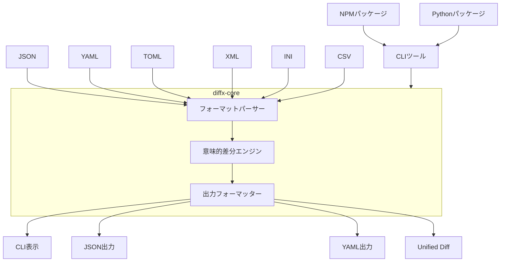
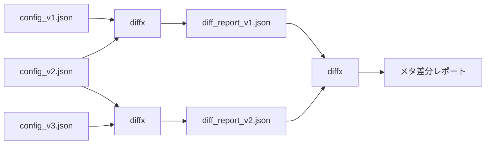

# diffx

> **🚀 構造化データの意味的差分 - フォーマットではなく本質に集中**

[English README](README.md) | [日本語版 README](README_ja.md) | [中文版 README](README_zh.md)

[](https://github.com/kako-jun/diffx/actions/workflows/ci.yml)
[](https://crates.io/crates/diffx)
[](https://docs.rs/diffx-core)
[](https://www.npmjs.com/package/diffx-js)
[](https://pypi.org/project/diffx-python/)
[](https://github.com/kako-jun/diffx/tree/main/docs/index.md)
[](https://docs.rs/diffx-core)
[](LICENSE)

データの**構造**と**意味**を理解する次世代diffツール。テキストの変更ではなく、本質的な差分を抽出。JSON、YAML、TOML、XML、INI、CSVファイルに最適。

```bash
# 従来のdiffはフォーマットのノイズを表示（キー順序、ケツカンマなど）
$ diff config_v1.json config_v2.json
< {
<   "name": "myapp",
<   "version": "1.0"
< }
> {
>   "version": "1.1",
>   "name": "myapp"
> }

# diffxは意味的な変更のみを表示
$ diffx config_v1.json config_v2.json
~ version: "1.0" -> "1.1"
```

## ✨ 主な特徴

- **🎯 意味的認識**: フォーマット、キー順序、空白、ケツカンマを無視
- **🔧 多様なフォーマット**: JSON、YAML、TOML、XML、INI、CSV対応
- **🤖 AI対応**: 自動化やAI分析に最適なクリーンなCLI出力
- **⚡ 高速**: Rustで構築された最大限のパフォーマンス
- **🔗 メタチェイン**: 差分レポートを比較して変更の進化を追跡

## 📊 性能

AMD Ryzen 5 PRO 4650Uでの実測ベンチマーク結果：

```bash
# テストファイル: ネストした設定を含む約600バイトのJSON
$ time diff large_test1.json large_test2.json  # 15行以上のノイズを表示
$ time diffx large_test1.json large_test2.json # 3つの意味的変更を表示

# 結果:
従来のdiff: ~0.002秒（フォーマットノイズあり）
diffx:      ~0.005秒（クリーンな意味的出力）
```

**AI時代にCLIが重要な理由**: AI ツールが開発ワークフローに不可欠になる中、構造化された機械可読な差分出力が重要になります。`diffx`はAIが理解し推論できるクリーンで解析可能な結果を提供し、自動コードレビュー、設定管理、インテリジェントなデプロイメントパイプラインに最適です。

## diffxを使う理由

従来の`diff`は見た目の変更をたくさん表示します。`diffx`は本当に変わった部分だけを教えてくれます。

- **意味に注目**: キーの順序や空白、フォーマットを無視
- **多様な形式**: JSON、YAML、TOML、XML、INI、CSVに対応  
- **きれいな出力**: 人間にもスクリプトにもAIにも優しい

## 仕様（Specification）

### 対応フォーマット
- JSON
- YAML
- TOML
- XML
- INI
- CSV

### 差分の種類
- キーの追加・削除
- 値の変更
- 配列の挿入・削除・変更
- ネスト構造の差分
- 値の型変更

### 出力形式
`diffx`は、構造化データの差分を最も豊かに表現できる独自のCLI表示形式を推奨しますが、特定のユースケースや既存ツールとの連携のために、以下の代替出力形式もサポートします。

- **推奨CLI表示 (デフォルト)**
    *   構造的な差分（追加、変更、削除、型変更など）を人間が理解しやすいように、ユニバーサルデザインに配慮した色分けや記号、インデントを用いて明確に表示する独自形式です。
    *   `+` (追加), `-` (削除), `~` (変更), `!` (型変更) の記号と、青、黄、シアン、マゼンタの色で差分を表現します。
    *   **特徴**: データの意味的な変更に焦点を当て、キーの順序や空白の変更は無視します。これが `diffx` の核となる価値です。

- **JSON形式**
    *   機械可読な形式です。CI/CDや他のプログラムとの連携に利用します。
    *   `diffx` の検出した差分がJSON配列として出力されます。

- **YAML形式**
    *   機械可読な形式です。JSONと同様にプログラムとの連携に利用します。
    *   `diffx` の検出した差分がYAML配列として出力されます。

- **diff互換形式 (Unified Format)**
    *   `--output unified` オプションで提供されます。
    *   `git` や既存のマージツールとの連携を目的としています。
    *   **注意点**: この形式は、`diffx` が検出した意味的な差分のみを従来のdiff形式で表現します。意味的な差分ではない変更（キーの順序変更、空白の変更など）は表示されません。あくまで既存ツールとの互換性のための補助的な位置づけです。

## 🏗️ アーキテクチャ

### システム概要



### プロジェクト構造

```
diffx/
├── diffx-core/      # 差分抽出ライブラリ（Crate）
├── diffx-cli/       # CLIラッパー
├── tests/           # すべてのテスト関連ファイル
│   ├── fixtures/    # テスト用入力データ
│   ├── integration/ # CLI統合テスト
│   ├── unit/        # コアライブラリユニットテスト
│   └── output/      # テスト中間ファイル
├── docs/            # ドキュメントと仕様書
└── ...
```

### 技術スタック

- **Rust**（高速・安全・クロスプラットフォーム）
- `serde_json`, `serde_yml`, `toml`, `configparser`, `quick-xml`, `csv` パーサー
- `clap`（CLI引数解析）
- `colored`（CLI出力の色付け）
- `similar`（Unified Format出力）

## 🔗 メタチェイン

差分レポートを比較して、変更の進化を時系列で追跡：



```bash
$ diffx config_v1.json config_v2.json --output json > report1.json
$ diffx config_v2.json config_v3.json --output json > report2.json
$ diffx report1.json report2.json  # 変更の変更を比較！
```

## 🚀 クイックスタート

### インストール

```bash
# Rust（推奨 - ネイティブパフォーマンス）
cargo install diffx

# Node.jsエコシステム
npm install diffx-js

# Pythonエコシステム
pip install diffx-python

# またはGitHub Releasesから事前ビルド済みバイナリをダウンロード
```

詳細な使い方とサンプルは [ドキュメント](docs/index.md) をご確認ください。

### クイックドキュメントリンク

- **[はじめに](docs/user-guide/getting-started.md)** - 基本を学ぶ
- **[インストールガイド](docs/user-guide/installation.md)** - プラットフォーム別セットアップ
- **[CLIリファレンス](docs/reference/cli-reference.md)** - 完全なコマンドリファレンス
- **[実用例](docs/user-guide/examples.md)** - 業界別使用例
- **[統合ガイド](docs/guides/integrations.md)** - CI/CD と自動化

### 基本的な使い方

```bash
# JSONファイルを比較
diffx file1.json file2.json

# 異なる出力形式で比較
diffx config.yaml config_new.yaml --output json
diffx data.toml data_updated.toml --output yaml

# 高度なフィルタリングオプション
diffx large.json large_v2.json --ignore-keys-regex "^timestamp$|^_.*"
diffx users.json users_v2.json --array-id-key "id"
diffx metrics.json metrics_v2.json --epsilon 0.001

# 高需要な実用的オプション
diffx config.yaml config_new.yaml --ignore-case          # 大文字小文字の違いを無視
diffx api.json api_formatted.json --ignore-whitespace    # 空白の変更を無視
diffx large.json large_v2.json --context 3 --output unified  # 3行のコンテキストを表示
diffx file1.json file2.json --quiet && echo "ファイルが同じ"  # スクリプト自動化
diffx dir1/ dir2/ --recursive --brief                    # 高速ファイル変更チェック

# 大きなファイルの性能最適化
diffx huge_dataset.json huge_dataset_v2.json
# ディレクトリ比較
diffx config_dir1/ config_dir2/ --recursive

# 変更追跡のメタチェイニング
diffx config_v1.json config_v2.json --output json > diff1.json
diffx config_v2.json config_v3.json --output json > diff2.json
diffx diff1.json diff2.json  # 変更の変更を比較！
```

### 統合例

**CI/CDパイプライン：**

```yaml
- name: 設定変更のチェック
  run: |
    diffx config/prod.yaml config/staging.yaml --output json > changes.json
    # デプロイ検証のためにchanges.jsonを処理

- name: 高速ファイル変更検知
  run: |
    if ! diffx config/current.json config/new.json --quiet; then
      echo "設定が変更されました、デプロイを開始します"
    fi

- name: クリーンな差分のための無視オプション付き比較
  run: |
    diffx api_old.json api_new.json --ignore-case --ignore-whitespace --output json > api_changes.json
    # フォーマットを無視し、意味的変更に集中

- name: 大きなデータセットの効率的比較
  run: |
    diffx large_prod_data.json large_staging_data.json --output json > data_changes.json
    # CIでの大きなファイルの最適化処理
```

**Gitフック：**

```bash
#!/bin/bash
# pre-commitフック
if diffx package.json HEAD~1:package.json --output json | jq -e '.[] | select(.Added)' > /dev/null; then
  echo "新しい依存関係が検出されました、セキュリティ監査を実行中..."
fi
```

## 🌍 多言語サポート

diffxは複数のエコシステムで利用可能：

```bash
# Rust（ネイティブCLI）
cargo install diffx

# Node.jsラッパー
npm install diffx-js

# Pythonラッパー
pip install diffx-python
```

すべてのパッケージは自動バイナリダウンロードで同じ意味的差分機能を提供します。

## 🔮 将来の計画

- **インタラクティブTUI (`diffx-tui`)**: diffxの機能を示すパワフルなビューアーで、サイドバイサイドのデータ表示
- **AIエージェント統合**: 自動差分要約と説明
- **Web UI版** (`diffx-web`)
- **VSCode拡張** (`diffx-vscode`)
- **高度なCI/CDテンプレート**: 一般的なユースケース向けの事前構築済みワークフロー

## 🤝 コントリビューション

コントリビューションを歓迎します！詳細は [CONTRIBUTING.md](CONTRIBUTING.md) をご確認ください。

## 📄 ライセンス

MIT License - 詳細は [LICENSE](LICENSE) をご確認ください。
