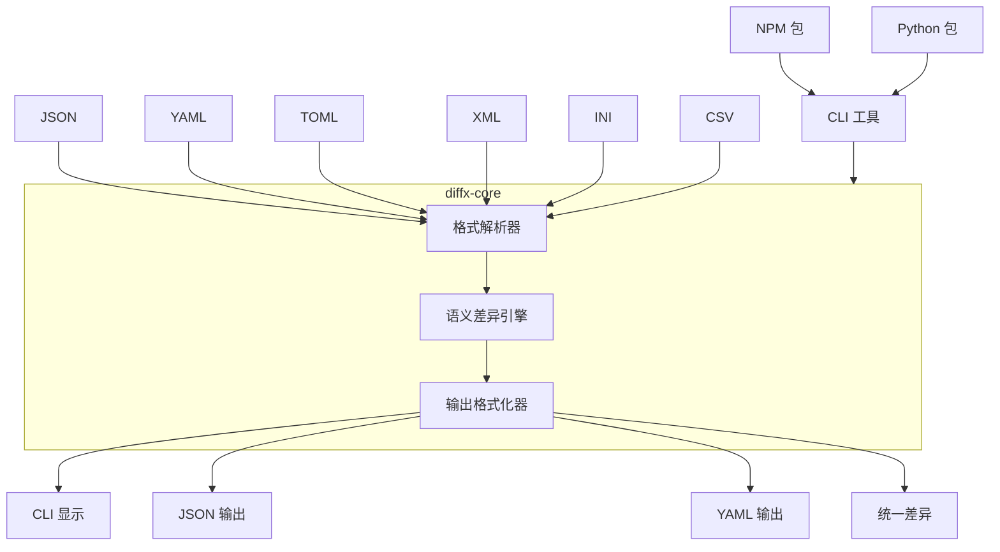
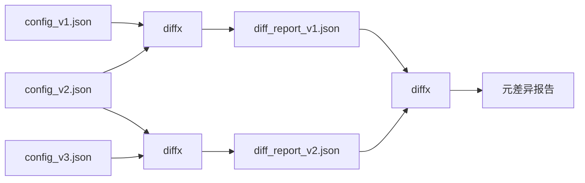

# diffx

> **🚀 结构化数据的语义差异对比 - 专注于重要内容，而非格式**

[English README](README.md) | [日本語版 README](README_ja.md) | [中文版 README](README_zh.md)

[](https://github.com/kako-jun/diffx/actions/workflows/ci.yml)
[](https://crates.io/crates/diffx)
[](https://crates.io/crates/diffx-core)
[](https://www.npmjs.com/package/diffx-js)
[](https://pypi.org/project/diffx-python/)
[](https://github.com/kako-jun/diffx/tree/main/docs/index_zh.md)
[](https://docs.rs/diffx-core)
[](LICENSE)

下一代差异对比工具，能够理解数据的**结构**和**含义**，而非仅仅是文本变更。完美支持 JSON、YAML、TOML、XML、INI 和 CSV 文件。

```bash
# 传统 diff 显示格式噪音（键顺序、尾随逗号）
$ diff config_v1.json config_v2.json
< {
<   "name": "myapp",
<   "version": "1.0"
< }
> {
>   "version": "1.1",
>   "name": "myapp"
> }

# diffx 仅显示语义变更
$ diffx config_v1.json config_v2.json
~ version: "1.0" -> "1.1"
```

## ✨ 核心特性

- **🎯 语义感知**: 忽略格式、键顺序、空白字符和尾随逗号
- **🔧 多种格式**: 支持 JSON、YAML、TOML、XML、INI、CSV
- **🤖 AI 友好**: 干净的 CLI 输出，完美适配自动化和 AI 分析
- **⚡ 高性能**: 基于 Rust 构建，性能卓越
- **🔗 元链式**: 比较差异报告以跟踪变更演进

## 📊 性能表现

在 AMD Ryzen 5 PRO 4650U 上的真实基准测试结果：

```bash
# 测试文件: ~600 字节的嵌套配置 JSON
$ time diff large_test1.json large_test2.json  # 显示 15+ 行噪音
$ time diffx large_test1.json large_test2.json # 显示 3 个语义变更

# 结果：
传统 diff: ~0.002s (但带有格式噪音)
diffx:     ~0.005s (干净的语义输出)
```

**为什么 CLI 在 AI 时代很重要**：随着 AI 工具在开发工作流程中变得必不可少，拥有结构化、机器可读的差异输出变得至关重要。`diffx` 提供干净、可解析的结果，AI 可以理解和推理，使其成为自动化代码审查、配置管理和智能部署管道的完美选择。

## 为什么选择 diffx？

传统的 `diff` 工具显示格式噪音。`diffx` 显示真正发生的变更。

- **专注含义**: 忽略键顺序、空白字符和格式
- **多种格式**: 支持 JSON、YAML、TOML、XML、INI、CSV
- **干净输出**: 完美适配人类、脚本和 AI 分析

## 规格说明

### 支持的格式

- JSON
- YAML
- TOML
- XML
- INI
- CSV

### 差异类型

- 键的添加/删除
- 值变更
- 数组插入/删除/修改
- 嵌套结构差异
- 值类型变更

### 输出格式

`diffx` 默认使用 **diffx 格式** 输出差异 - 专为结构化数据设计的语义差异表示。diffx 格式提供了结构差异的最丰富表达，可与机器可读格式相结合进行集成：

- **diffx 格式（默认）**

  - **diffx 格式** 是一种人类可读的语义差异表示，使用直观的符号和层次路径清楚地显示结构差异（添加、变更、删除、类型变更等）。
  - 差异由 `+`（添加）、`-`（删除）、`~`（变更）、`!`（类型变更）符号表示，具有完整的路径上下文（例如，`database.connection.host`）。
  - **核心特性**: 专注于数据的语义变更，忽略键顺序、空白字符和格式的变更。这种语义焦点是工具和 diffx 格式的基本价值。

- **JSON 格式**

  - 机器可读格式。用于 CI/CD 和与其他程序的集成。
  - `diffx` 检测到的差异以 JSON 数组形式输出。

- **YAML 格式**

  - 机器可读格式。用于 CI/CD 和与其他程序的集成，类似于 JSON。
  - `diffx` 检测到的差异以 YAML 数组形式输出。

- **diff 兼容格式（统一格式）**
  - 通过 `--output unified` 选项提供。
  - 用于与 `git` 和现有合并工具的集成。
  - **注意**: 此格式仅以传统 diff 格式显示 `diffx` 检测到的语义差异。非语义差异的变更（例如键顺序变更、空白字符变更）不会显示。这纯粹是为了与现有工具的兼容性。

## 🏗️ 架构

### 系统概览



### 项目结构

```
diffx/
├── diffx-core/      # 差异提取库（Crate）
├── diffx-cli/       # CLI 包装器
├── tests/           # 所有测试相关文件
│   ├── fixtures/    # 测试输入数据
│   ├── integration/ # CLI 集成测试
│   ├── unit/        # 核心库单元测试
│   └── output/      # 测试中间文件
├── docs/            # 文档和规范
└── ...
```

### 技术栈

- **Rust**（快速、安全、跨平台）
- `serde_json`、`serde_yml`、`toml`、`configparser`、`quick-xml`、`csv` 解析器
- `clap`（CLI 参数解析）
- `colored`（CLI 输出着色）
- `similar`（统一格式输出）

## 🔗 元链式

比较差异报告以跟踪变更随时间的演进：



```bash
$ diffx config_v1.json config_v2.json --output json > report1.json
$ diffx config_v2.json config_v3.json --output json > report2.json
$ diffx report1.json report2.json  # 比较变更本身！
```

## 🚀 快速开始

### 安装

```bash
# 安装 CLI 工具
cargo install diffx
```

详细用法和示例，请参阅[文档](docs/index_zh.md)。

### 快速文档链接

- **[快速入门](docs/user-guide/getting-started_zh.md)** - 学习基础知识
- **[安装指南](docs/user-guide/installation_zh.md)** - 平台特定设置
- **[CLI 参考](docs/reference/cli-reference_zh.md)** - 完整命令参考
- **[实际示例](docs/user-guide/examples_zh.md)** - 行业用例
- **[集成指南](docs/guides/integrations_zh.md)** - CI/CD 和自动化

### 基本用法

```bash
# 比较 JSON 文件
diffx file1.json file2.json

# 使用不同的输出格式进行比较
diffx config.yaml config_new.yaml --output json
diffx data.toml data_updated.toml --output yaml

# 高级选项
diffx large.json large_v2.json --ignore-keys-regex "^timestamp$|^_.*"
diffx users.json users_v2.json --array-id-key "id"
diffx metrics.json metrics_v2.json --epsilon 0.001

# 大文件性能优化
diffx huge_dataset.json huge_dataset_v2.json --optimize
diffx massive_config.yaml massive_config_new.yaml --optimize --batch-size 5000

# 目录比较
diffx config_dir1/ config_dir2/ --recursive

# 变更跟踪的元链式
diffx config_v1.json config_v2.json --output json > diff1.json
diffx config_v2.json config_v3.json --output json > diff2.json
diffx diff1.json diff2.json  # 比较变更本身！
```

### 集成示例

**CI/CD 管道：**

```yaml
- name: 检查配置变更
  run: |
    diffx config/prod.yaml config/staging.yaml --output json > changes.json
    # 处理 changes.json 进行部署验证

- name: 高效比较大数据集  
  run: |
    diffx large_prod_data.json large_staging_data.json --optimize --output json > data_changes.json
    # 在 CI 中优化处理大文件
```

**Git 钩子：**

```bash
#!/bin/bash
# pre-commit 钩子
if diffx package.json HEAD~1:package.json --output json | jq -e '.[] | select(.Added)' > /dev/null; then
  echo "检测到新依赖，正在运行安全审计..."
fi
```

## 🔮 未来计划

- **交互式 TUI (`diffx-tui`)**: 强大的查看器，展示 diffx 功能，支持并排数据显示
- **语言包装器**: Node.js 和 Python 包用于调用 diffx CLI
- **GitHub Actions 集成**: 内置差异检查工作流
- **AI 代理集成**: 自动化差异摘要和解释
- **Web UI 版本** (`diffx-web`)
- **VSCode 扩展** (`diffx-vscode`)

## 🤝 贡献

我们欢迎贡献！请查看 [CONTRIBUTING.md](CONTRIBUTING.md) 了解指南。

## 📄 许可证

MIT 许可证 - 详情请参阅 [LICENSE](LICENSE)。