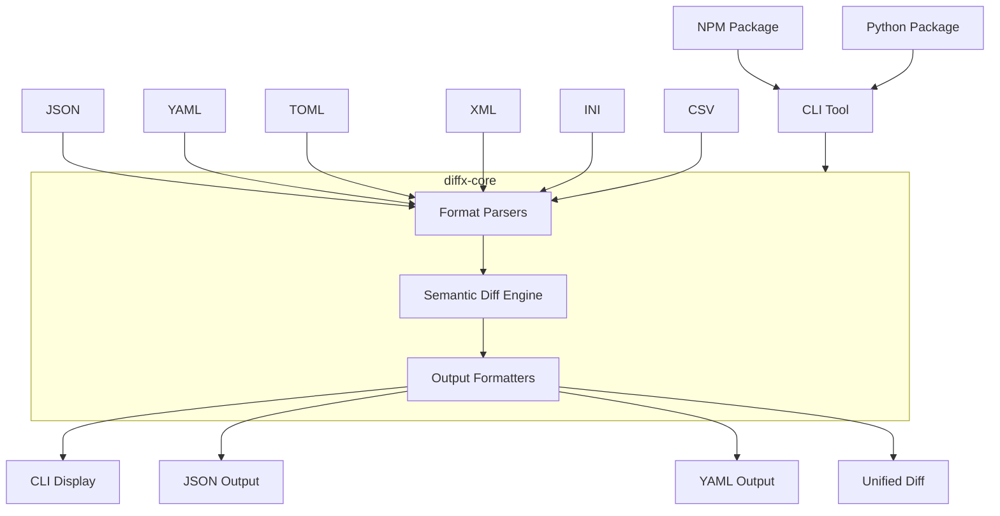
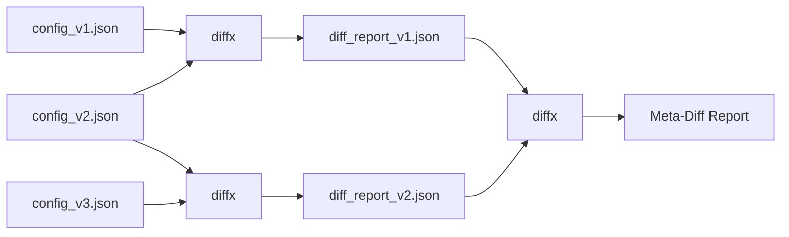

# diffx

> **🚀 结构化数据的语义差分 - 专注于内容而非格式**

[English README](README.md) | [日本語版 README](README_ja.md) | [中文版 README](README_zh.md)

[](https://github.com/kako-jun/diffx/actions/workflows/ci.yml)
[](https://crates.io/crates/diffx)
[](https://docs.rs/diffx-core)
[](https://www.npmjs.com/package/diffx-js)
[](https://pypi.org/project/diffx-python/)
[](https://github.com/kako-jun/diffx/tree/main/docs/index_zh.md)
[](https://docs.rs/diffx-core)
[](LICENSE)

下一代差分工具，理解数据的**结构**和**意义**，而不仅仅是文本更改。完美支持JSON、YAML、TOML、XML、INI和CSV文件。

```bash
# 传统的diff显示格式噪音（键顺序、尾随逗号）
$ diff config_v1.json config_v2.json
< {
<   "name": "myapp",
<   "version": "1.0"
< }
> {
>   "version": "1.1",
>   "name": "myapp"
> }

# diffx仅显示语义变化
$ diffx config_v1.json config_v2.json
~ version: "1.0" -> "1.1"
```

## ✨ 主要特性

- **🎯 语义识别**: 忽略格式、键顺序、空白和尾随逗号
- **🔧 多格式支持**: 支持JSON、YAML、TOML、XML、INI、CSV
- **🤖 AI友好**: 适合自动化和AI分析的清洁CLI输出
- **⚡ 高速**: 用Rust构建，实现最大性能
- **🔗 元链接**: 比较差分报告来跟踪变化演变

## 📊 性能

在AMD Ryzen 5 PRO 4650U上的实际基准测试结果：

```bash
# 测试文件：包含嵌套配置的约600字节JSON
$ time diff large_test1.json large_test2.json  # 显示15+行噪音
$ time diffx large_test1.json large_test2.json # 显示3个语义变化

# 结果：
传统的diff： ~0.002秒（但包含格式噪音）
diffx：      ~0.005秒（清洁的语义输出）
```

**为什么CLI在AI时代很重要**: 随着AI工具在开发工作流中变得不可或缺，拥有结构化的机器可读差分输出变得至关重要。`diffx`提供了AI可以理解和推理的清洁、可解析的结果，使其非常适合自动化代码审查、配置管理和智能部署管道。

## 为什么选择diffx？

传统的`diff`工具显示格式噪音。`diffx`展示真正变化的内容。

- **专注意义**: 忽略键顺序、空白和格式
- **多格式支持**: 支持JSON、YAML、TOML、XML、INI、CSV
- **清洁输出**: 适合人类、脚本和AI分析

## 规格说明

### 支持的格式

- JSON
- YAML
- TOML
- XML
- INI
- CSV

### 差异类型

- 键的添加/删除
- 值的更改
- 数组的插入/删除/修改
- 嵌套结构差异
- 值类型变化

### 输出格式

`diffx`默认以**diffx格式**输出差异 - 专为结构化数据设计的语义差分表示。diffx格式提供了最丰富的结构差异表达，并可以与机器可读格式相结合进行集成：

- **diffx格式（默认）**

  - **diffx格式**是一种人类可读的语义差分表示，使用直观的符号和层次路径清晰地显示结构差异（添加、更改、删除、类型变化等）。
  - 差异由`+`（添加）、`-`（删除）、`~`（更改）、`!`（类型变化）符号表示，并包含完整的路径上下文（例如，`database.connection.host`）。
  - **核心特性**: 专注于数据中的语义变化，忽略键顺序、空白和格式的变化。这种语义专注是工具和diffx格式的根本价值。

- **JSON格式**

  - 机器可读格式。用于CI/CD和与其他程序的集成。
  - `diffx`检测到的差异作为JSON数组输出。

- **YAML格式**

  - 机器可读格式。用于CI/CD和与其他程序的集成，类似JSON。
  - `diffx`检测到的差异作为YAML数组输出。

- **diff兼容格式（统一格式）**
  - 通过`--output unified`选项提供。
  - 旨在与`git`和现有合并工具集成。
  - **注意**: 此格式仅以传统的diff格式显示`diffx`检测到的语义差异。非语义差异的变化（例如键顺序变化、空白变化）不会显示。这纯粹是为了与现有工具兼容。

## 🏗️ 架构

### 系统概述


```mermaid
graph TB
    subgraph Core["diffx-core"]
        B[Format Parsers]
        C[Semantic Diff Engine]
        D[Output Formatters]
        B --> C --> D
    end

    E[CLI Tool] --> Core
    F[NPM Package] --> E
    G[Python Package] --> E

    H[JSON] --> B
    I[YAML] --> B
    J[TOML] --> B
    K[XML] --> B
    L[INI] --> B
    M[CSV] --> B

    D --> N[CLI Display]
    D --> O[JSON Output]
    D --> P[YAML Output]
    D --> Q[Unified Diff]
```

### 项目结构

```
diffx/
├── diffx-core/      # Diff extraction library (Crate)
├── diffx-cli/       # CLI wrapper
├── tests/           # All test-related files
│   ├── fixtures/    # Test input data
│   ├── integration/ # CLI integration tests
│   ├── unit/        # Core library unit tests
│   └── output/      # Test intermediate files
├── docs/            # Documentation and specifications
└── ...
```

### 技术栈

- **Rust**（快速、安全、跨平台）
- `serde_json`、`serde_yml`、`toml`、`configparser`、`quick-xml`、`csv`解析器
- `clap`（CLI参数解析）
- `colored`（CLI输出着色）
- `similar`（统一格式输出）

## 🔗 Meta-Chaining

Compare diff reports to track how changes evolve over time:


```mermaid
graph LR
    A[config_v1.json] --> D1[diffx]
    B[config_v2.json] --> D1
    D1 --> R1[diff_report_v1.json]

    B --> D2[diffx]
    C[config_v3.json] --> D2
    D2 --> R2[diff_report_v2.json]

    R1 --> D3[diffx]
    R2 --> D3
    D3 --> M[Meta-Diff Report]
```

```bash
$ diffx config_v1.json config_v2.json --output json > report1.json
$ diffx config_v2.json config_v3.json --output json > report2.json
$ diffx report1.json report2.json  # Compare the changes themselves!
```

## 🚀 Quick Start

### Installation

```bash
# Rust (recommended - native performance)
cargo install diffx

# Node.js ecosystem (⚡ offline-ready with all platform binaries)
npm install diffx-js

# Python ecosystem (🆕 self-contained wheel with embedded binary)
pip install diffx-python

# Or download pre-built binaries from GitHub Releases
```

有关详细用法和示例，请参见[文档](docs/index_zh.md)。

### Quick Documentation Links

- **[入门指南](docs/user-guide/getting-started_zh.md)** - 学习基础知识
- **[安装指南](docs/user-guide/installation_zh.md)** - 平台特定设置
- **[CLI参考](docs/reference/cli-reference_zh.md)** - 完整命令参考
- **[实际示例](docs/user-guide/examples_zh.md)** - 行业用例
- **[集成指南](docs/guides/integrations_zh.md)** - CI/CD和自动化

### Basic Usage

```bash
# Compare JSON files
diffx file1.json file2.json

# Compare with different output formats
diffx config.yaml config_new.yaml --output json
diffx data.toml data_updated.toml --output yaml

# Advanced filtering options
diffx large.json large_v2.json --ignore-keys-regex "^timestamp$|^_.*"
diffx users.json users_v2.json --array-id-key "id"
diffx metrics.json metrics_v2.json --epsilon 0.001

# High-demand practical options
diffx config.yaml config_new.yaml --ignore-case          # Ignore case differences
diffx api.json api_formatted.json --ignore-whitespace    # Ignore whitespace changes
diffx large.json large_v2.json --context 3 --output unified  # Show 3 lines of context
diffx file1.json file2.json --quiet && echo "Files identical"  # Script automation
diffx dir1/ dir2/ --recursive --brief                    # Quick file change check

# Performance optimization for large files
diffx huge_dataset.json huge_dataset_v2.json
# Directory comparison
diffx config_dir1/ config_dir2/ --recursive

# Meta-chaining for change tracking
diffx config_v1.json config_v2.json --output json > diff1.json
diffx config_v2.json config_v3.json --output json > diff2.json
diffx diff1.json diff2.json  # Compare the changes themselves!
```

### Integration Examples

**CI/CD Pipeline:**

```yaml
- name: Check configuration changes
  run: |
    diffx config/prod.yaml config/staging.yaml --output json > changes.json
    # Process changes.json for deployment validation

- name: Quick file change detection
  run: |
    if ! diffx config/current.json config/new.json --quiet; then
      echo "Configuration changed, triggering deployment"
    fi

- name: Compare with ignore options for cleaner diffs
  run: |
    diffx api_old.json api_new.json --ignore-case --ignore-whitespace --output json > api_changes.json
    # Focus on semantic changes, ignore formatting

- name: Compare large datasets efficiently  
  run: |
    diffx large_prod_data.json large_staging_data.json --output json > data_changes.json
    # Optimized processing for large files in CI
```

**Git Hook:**

```bash
#!/bin/bash
# pre-commit hook
if diffx package.json HEAD~1:package.json --output json | jq -e '.[] | select(.Added)' > /dev/null; then
  echo "New dependencies detected, running security audit..."
fi
```

## 🌍 Multi-Language Support

diffx is available across multiple ecosystems:

```bash
# Rust (native CLI)
cargo install diffx

# Node.js wrapper
npm install diffx-js

# Python wrapper  
pip install diffx-python
```

All packages provide the same semantic diff capabilities:
- **Rust**: Source-based compilation 
- **npm**: Universal package with all platform binaries (offline-ready)
- **Python**: Self-contained wheels with embedded binaries

## 🔮 Future Plans

- **Interactive TUI (`diffx-tui`)**: A powerful viewer showcasing diffx capabilities with side-by-side data display
- **AI agent integration**: Automated diff summarization and explanation
- **Web UI version** (`diffx-web`)
- **VSCode extension** (`diffx-vscode`)
- **Advanced CI/CD templates**: Pre-built workflows for common use cases

## 🤝 Contributing

We welcome contributions! See [CONTRIBUTING.md](CONTRIBUTING.md) for guidelines.

## 📄 License

MIT License - see [LICENSE](LICENSE) for details.